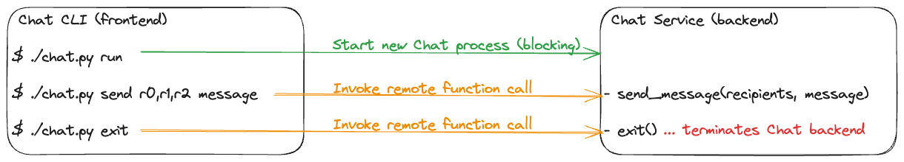
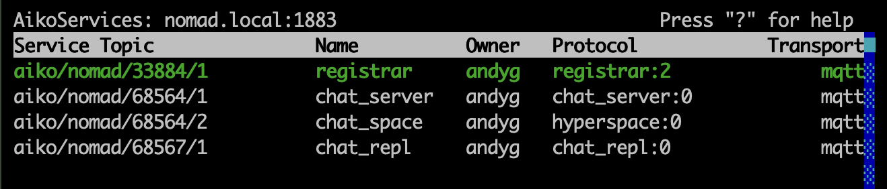

# Aiko Chat: Distributed group discussion application

## Overview

An example of using Aiko Services to implement a group discussion frontend and backend server.

The Aiko Chat frontend CLI can be used to start, interact with and stop the Aiko Chat backend server.

Multiple copies of the Aiko Chat CLI [REPL](https://en.wikipedia.org/wiki/Read%E2%80%93eval%E2%80%93print_loop) session can be running at the same time.



## Set-up the development environment

```bash
python3 -m venv venv      # Create a new Python virtual environment
source venv/bin/activate

git clone https://github.com/geekscape/aiko_services.git
cd aiko_services
pip install -e .
cd ..

git clone https://github.com/geekscape/aiko_chat.git
cd aiko_chat
pip install -e .
cd ..
```

## Prerequisites

An MQTT server, e.g `mosquitto` and the `Aiko Services Registrar` need to be already running ... see [this script](https://github.com/geekscape/aiko_services/blob/master/scripts/system_start.sh).

The MQTT server `mosquitto` can be running on any host, either locally or accessible over the Internet.

The `Aiko Services Registrar` can also be running anywhere ... and it is easiest to start by running it locally.

**For every process involved, make sure that the `AIKO_MQTT_HOST` environment variable references the correct (same) MQTT server host.**

## Usage

Each of the following terminal sessions needs to be operating in the development environment's **Python virtual environment**.

### Start Aiko Dashboard for monitoring and diagnosis

You may leave the Aiko Services Dashboard running ... and also watch the Aiko Chat Services in operation.

```bash
# Terminal session 1
$ source venv/bin/activate
$ aiko_dashboard      # Check mosquitto and Aiko Registrar are running correctly
```

The following screen snapshot is the Aiko Services Dashboard showing the backend Chat server and the frontend CLI [REPL](https://en.wikipedia.org/wiki/Read%E2%80%93eval%E2%80%93print_loop).



### Start the Aiko Chat Service

```bash
# Terminal session 2
$ source venv/bin/activate
$ aiko_chat run       # Block until the Aiko Chat Service is terminated
```

### Send messages via the Aiko Chat Service

As messages are sent, the log output should also appear on Terminal session 2 (above)

```bash
# Terminal session 3
$ source venv/bin/activate
$ aiko_chat repl      # Start Chat CLI REPL session
Type ":exit" to exit
Connected    chat_server: aiko/host/123/1
> hello               # Message sent to send_message(recipients, message)
['general']: hello    # Reponse received from Aiko Chat Service
> goodbye
['general']: goodbye
> :exit               # Exit Chat CLI REPL session
s the Aiko Chat Service process
```

### Stop the Aiko Chat Service

```bash
# Terminal session 3
$ source venv/bin/activate
$ aiko_chat exit      # Terminate the Aiko Chat Service process
```